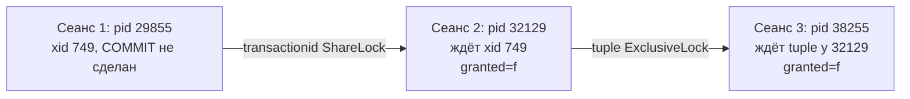

# Отчёт по домашнему заданию: механизм блокировок PostgreSQL

## Цель работы

1. Настроить сервер так, чтобы в журнал попадала информация о блокировках, удерживаемых **более 200 мс**.
2. Смоделировать три `UPDATE` одной строки в разных сеансах, разобрать `pg_locks`.
3. Воспроизвести взаимоблокировку трёх транзакций и оценить возможность разбора постфактум по журналу.
4. Определить, могут ли две транзакции с единственным `UPDATE` таблицы **без `WHERE`** заблокировать друг друга.

---

## Исходные условия

| Параметр | Значение |
|----------|----------|
| ОС | Astra Linux |
| СУБД | PostgreSQL **15.14** |
| База | `postgres` |
| Тестовая таблица | `a(b int)`, затем `ALTER TABLE ... ADD COLUMN c int` |
| Режим psql | `\set AUTOCOMMIT off` (явные `COMMIT` в сеансе 1) |

---

## 1. Настройка журналирования ожиданий блокировок (> 200 мс)

### Параметры

В PostgreSQL 15 порог ожидания задаётся **не** параметром `log_lock_waits`, а парой настроек:

| Параметр | Тип | Назначение |
|----------|-----|------------|
| `log_lock_waits` | **boolean** (`on` / `off`) | Включить запись в журнал, если сеанс ждёт блокировку дольше порога |
| `deadlock_timeout` | интервал | Порог ожидания: после него пишется предупреждение в лог и запускается проверка взаимоблокировки |

Попытка `ALTER SYSTEM SET log_lock_waits = '200ms'` даёт ошибку: параметр требует логическое значение. Для порога **200 мс** нужно:

```sql
ALTER SYSTEM SET log_lock_waits = on;
ALTER SYSTEM SET deadlock_timeout = '200ms';
SELECT pg_reload_conf();
```

Проверка:

```sql
SHOW log_lock_waits;      -- on
SHOW deadlock_timeout;    -- 200ms
```

### Воспроизведение записи в журнале

**Сеанс 1:** открытая транзакция с изменением данных (например, `INSERT` без `COMMIT`) — удерживается блокировка уровня отношения.

**Сеанс 2:** `ALTER TABLE a ADD COLUMN c int` — требуется **AccessExclusiveLock** на таблицу, несовместимая с блокировками активной транзакции в сеансе 1.

Фрагмент журнала (смысл сообщений):

```text
СООБЩЕНИЕ:  процесс 32129 продолжает ожидать в режиме AccessExclusiveLock
            блокировку "отношение 16391 базы данных 5" в течение 200.302 мс
ПОДРОБНОСТИ:  Process holding the lock: 29855. Wait queue: 32129.
ОПЕРАТОР:  alter table a add column c int;

...

СООБЩЕНИЕ:  процесс 32129 получил в режиме AccessExclusiveLock блокировку
            "отношение 16391 базы данных 5" через 13394.754 мс
ОПЕРАТОР:  alter table a add column c int;
```

| Поле в логе | Пояснение |
|-------------|-----------|
| PID **32129** | Сеанс, который **ждёт** (`ALTER TABLE`) |
| **AccessExclusiveLock** | Самый жёсткий режим на отношение; нужен для изменения схемы |
| **отношение 16391** | OID таблицы `a` в БД 5 (`postgres`) |
| **200.302 мс** | Ожидание превысило `deadlock_timeout` → запись в лог |
| **Process holding the lock: 29855** | Сеанс-владелец (незавершённая транзакция с DML) |
| **13394.754 мс** | Сколько всего ждали до получения блокировки (после `COMMIT` в сеансе 1) |

**Вывод по п.1:** порог 200 мс достигается за счёт `deadlock_timeout = 200ms` при включённом `log_lock_waits = on`. Сценарий «долгое ожидание DDL из‑за открытой транзакции» воспроизведён.

---

## 2. Три `UPDATE` одной строки в разных сеансах

### Подготовка

Таблица `a` с данными; строка `b = 10` обновляется в трёх сеансах:

| Сеанс | Команда | Состояние |
|-------|---------|-----------|
| 1 | `UPDATE a SET c = 5 WHERE b = 10;` | выполнен, транзакция **не закоммичена** |
| 2 | `UPDATE a SET c = 6 WHERE b = 10;` | **ждёт** |
| 3 | `UPDATE a SET c = 7 WHERE b = 10;` | **ждёт** |

Соответствие сеансов и процессов (по порядку запуска `UPDATE` и по PID из части 1):

| Сеанс | PID | xid | Команда |
|-------|-----|-----|---------|
| 1 | **29855** | **749** | `UPDATE … c = 5`, без `COMMIT` |
| 2 | **32129** | **750** | `UPDATE … c = 6`, завис |
| 3 | **38255** | **751** | `UPDATE … c = 7`, завис |
| 4 (снимок) | **38332** | — | `SELECT * FROM pg_locks` |

Таблица `a` — OID отношения **16391**; строка `b = 10` — кортеж **(page 0, tuple 3)**.

### Полный вывод `pg_locks` (15 строк)

```text
   locktype    | database | relation | page | tuple | virtualxid | transactionid | classid | objid | objsubid | virtualtransaction |  pid  |       mode       | granted | fastpath |           waitstart
---------------+----------+----------+------+-------+------------+---------------+---------+-------+----------+--------------------+-------+------------------+---------+----------+-------------------------------
 relation      |        5 |    12073 |      |       |            |               |         |       |          | 6/7                | 38332 | AccessShareLock  | t       | t        |
 virtualxid    |          |          |      |       | 6/7        |               |         |       |          | 6/7                | 38332 | ExclusiveLock    | t       | t        |
 relation      |        5 |    16391 |      |       |            |               |         |       |          | 5/337              | 38255 | RowExclusiveLock | t       | t        |
 virtualxid    |          |          |      |       | 5/337      |               |         |       |          | 5/337              | 38255 | ExclusiveLock    | t       | t        |
 relation      |        5 |    16391 |      |       |            |               |         |       |          | 4/377              | 32129 | RowExclusiveLock | t       | t        |
 virtualxid    |          |          |      |       | 4/377      |               |         |       |          | 4/377              | 32129 | ExclusiveLock    | t       | t        |
 relation      |        5 |    16391 |      |       |            |               |         |       |          | 3/770              | 29855 | AccessShareLock  | t       | t        |
 relation      |        5 |    16391 |      |       |            |               |         |       |          | 3/770              | 29855 | RowExclusiveLock | t       | t        |
 virtualxid    |          |          |      |       | 3/770      |               |         |       |          | 3/770              | 29855 | ExclusiveLock    | t       | t        |
 transactionid |          |          |      |       |            |           749 |         |       |          | 4/377              | 32129 | ShareLock        | f       | f        | 2026-05-19 17:38:55.20358+03
 tuple         |        5 |    16391 |    0 |     3 |            |               |         |       |          | 4/377              | 32129 | ExclusiveLock    | t       | f        |
 tuple         |        5 |    16391 |    0 |     3 |            |               |         |       |          | 5/337              | 38255 | ExclusiveLock    | f       | f        | 2026-05-19 17:40:10.309693+03
 transactionid |          |          |      |       |            |           751 |         |       |          | 5/337              | 38255 | ExclusiveLock    | t       | f        |
 transactionid |          |          |      |       |            |           749 |         |       |          | 3/770              | 29855 | ExclusiveLock    | t       | f        |
 transactionid |          |          |      |       |            |           750 |         |       |          | 4/377              | 32129 | ExclusiveLock    | t       | f        |
(15 строк)
```

### Как читать вывод: ориентир — колонка `granted`

| `granted` | Значение |
|-----------|----------|
| **`t`** | Блокировка **получена** — процесс её удерживает |
| **`f`** | Блокировка **не получена** — процесс **ждёт** (у конфликтных строк обычно заполнен `waitstart`) |

### Цепочка ожиданий (явно)

Это **линейная очередь**, не взаимоблокировка:

```text
Сеанс 1 (29855, xid 749)          Сеанс 2 (32129, xid 750)              Сеанс 3 (38255, xid 751)
UPDATE c=5, без COMMIT     →      UPDATE c=6 ждёт              →      UPDATE c=7 ждёт
                                  transactionid 749                      tuple (0,3)
                                  ShareLock, granted=f                   ExclusiveLock, granted=f
```

| Кто ждёт | Кого ждёт | Что видно в `pg_locks` | Смысл |
|----------|-----------|-------------------------|--------|
| **Сеанс 2** | **Сеанс 1** | `pid 32129`, `transactionid 749`, `ShareLock`, **`granted = f`** | Второй `UPDATE` не может завершиться, пока транзакция **749** не завершится — нужны **`COMMIT` или `ROLLBACK`** в сеансе 1 |
| **Сеанс 3** | **Сеанс 2** | `pid 38255`, `tuple (0,3)`, `ExclusiveLock`, **`granted = f`**; у `pid 32129` на тот же кортеж **`granted = t`** | Третий `UPDATE` стоит в очереди за **блокировкой строки**, которую в каталоге блокировок уже занял второй сеанс |

**Сеанс 1** в полном выводе:

- строки `transactionid | 749 | pid 29855 | ExclusiveLock | granted = t` — активная транзакция первого `UPDATE`;
- строки с `locktype = tuple` у **29855** **нет** — для конкурентов первая транзакция видна через ожидание чужого **xid 749**, а не обязательно через `tuple` у своего PID.

**Сеанс 2** одновременно:

- **`granted = t`** на `tuple (0,3)` — второй процесс уже в цепочке блокировок кортежа;
- **`granted = f`** на `ShareLock` для **749** — но продвинуться дальше нельзя, пока живёт сеанс 1.

Пока сеанс 1 не сделает `COMMIT`/`ROLLBACK`, разблокируется сеанс 2; только после этого сможет завершиться ожидание сеанса 3 на `tuple`.

### Схема ожидания (часть 2)



**Вывод по п.2:** . Второй сеанс заблокирован на **первом** (ожидание завершения txn **749**). Третий — на **втором** по блокировке **кортежа** `(0, 3)`. Это очередь из трёх уровней, а не deadlock.

---

## 3. Взаимоблокировка трёх транзакций

### Сценарий

| Сеанс | Действия |
|-------|----------|
| 1 | `UPDATE a SET c = 1 WHERE b = 1;` затем `UPDATE a SET c = 2 WHERE b = 10;` (без commit) |
| 2 | `UPDATE a SET c = 1 WHERE b = 2;` затем `UPDATE a SET c = 1 WHERE b = 1;` (ждёт строку `b=1`) |
| 3 | `UPDATE a SET c = 1 WHERE b = 10;` затем `UPDATE a SET c = 1 WHERE b = 2;` → **deadlock** |

Сообщение клиента:

```text
ОШИБКА:  обнаружена взаимоблокировка
ПОДРОБНОСТИ:
  Процесс 38255 ожидает ShareLock "транзакция 753"; заблокирован процессом 32129.
  Процесс 32129 ожидает ShareLock "транзакция 755"; заблокирован процессом 29855.
  Процесс 29855 ожидает ShareLock "транзакция 754"; заблокирован процессом 38255.
КОНТЕКСТ:  при изменении кортежа (0,2) в отношении "a"
```

### Цикл ожиданий

```text
29855 (txn 754) ──ждёт──► 38255 (txn 753)
       ▲                           │
       │                           │
       └──────── 32129 (txn 755) ◄─┘
```

| Процесс | Уже держит | Ждёт |
|---------|------------|------|
| 29855 | строку `b=1` (после 2-го UPDATE в сессии 1 — также работа с `b=10`) | завершение txn **754** (сессия 3) |
| 32129 | строку `b=2` | txn **755** (сессия 1) |
| 38255 | строку `b=10` | txn **753** (сессия 2) |

Каждая транзакция захватила **одну** строку и пытается захватить **другую**, уже занятую соседней сессией — классический цикл **AB → BC → CA**.

Детектор срабатывает по таймеру `deadlock_timeout` (200 ms): одна транзакция принудительно откатывается (`ERROR: deadlock detected`), остальные могут продолжить.

### Можно ли разобрать ситуацию постфактум по журналу?

| Источник | Что даёт |
|----------|----------|
| Сообщение клиента / `ПОДРОБНОСТИ` | Полный цикл PID и номеров транзакций — **достаточно для разбора** |
| Журнал сервера при `log_lock_waits = on` | Строки о **долгом ожидании** отдельных блокировок до deadlock; видно, **кто кого ждал** и сколько мс |
| Журнал при стандартном уровне | Запись **LOG** о deadlock (текст аналогичен `ПОДРОБНОСТИ`) — есть в PostgreSQL при обнаружении |
| Журнал без специальных настроек | Только факт отмены одной транзакции; **цепочку** без `deadlock_timeout`/deadlock log разобрать сложнее |

**Вывод по п.3:** да, **постфактум разобрать можно**: оптимально — строка `DETAIL` взаимоблокировки (PID + xid + направление ожиданий). С `log_lock_waits` и `deadlock_timeout = 200ms` в логе дополнительно видна **хронология ожиданий** до срабатывания детектора. Без deadlock-сообщения одних audit-событий недостаточно.

---

## 4. Два `UPDATE` одной таблицы без `WHERE` — блокируют ли друг друга?

### Краткий ответ

**Да, могут взаимно ждать** (блокировка на уровне **строк**), но при **одной** команде `UPDATE` в каждой транзакции **взаимоблокировка маловероятна**, если только обе не обновляют **одни и те же строки** в разном порядке.

### Почему

1. На таблицу обе берут **RowExclusiveLock** — они **совместимы**, таблица не «запирается» целиком.
2. Без `WHERE` обе транзакции сканируют таблицу и для **каждой** строки запрашивают **ExclusiveLock** на кортеж.
3. Как только вторая доходит до строки, уже изменённой первой незавершённой транзакцией, она **ждёт** (в `pg_locks`: `tuple`, `granted = f`).
4. **Deadlock** при одном `UPDATE` без `WHERE` в каждой сессии возможен, если сканирование приводит к захвату **перекрёстных** строк в разном порядке(например, одна транзакция сканирует последовательно, другая через индекс).

## Итоговые выводы

1. Журналирование ожиданий **> 200 мс**: `log_lock_waits = on` + `deadlock_timeout = '200ms'` + `SELECT pg_reload_conf();`. Воспроизведено на конфликте **DML-транзакции** vs **ALTER TABLE** (AccessExclusiveLock).
2. Три `UPDATE` одной строки: одна транзакция владеет **tuple ExclusiveLock** и своим **xid**; остальные ждут с `granted = f` в `pg_locks`.
3. Deadlock трёх сессий: цикл ожиданий **xid** / строк; разбор возможен по `ПОДРОБНОСТИ` ошибки и по записям `log_lock_waits` в журнале.
4. Два `UPDATE` без `WHERE`: ** могут блокировать друг друга** на уровне строк.

---

